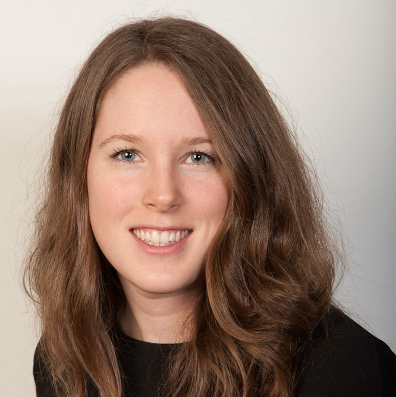

My research group is broadly focused on democracy and political representation in Canada, with a particular emphasis on local and urban politics. We meet regularly to share ideas, discuss new research, plan research projects, and provide feedback. The research group is based at the University of Calgary but includes members from across Canada. If you have an interest in joining the research group, please get in touch! 

## Current Group Members

**Sarah Lachance** is a Postdoctoral Fellow affiliated with POLPOP-II, a comparative international study of regional and national elected representatives. Her research investigates questions related to political psychology and political behaviour in Canada and other democracies. She is particularly interested in voter and elite decision-making, as well as democratic representation.

**Tyler Romualdi** is a Ph.D. candidate in the Department of Political Science at Western University. His research focuses on Canadian and urban politics, with a particular emphasis on the welfare state and the historical development of individuals' policy attitudes.