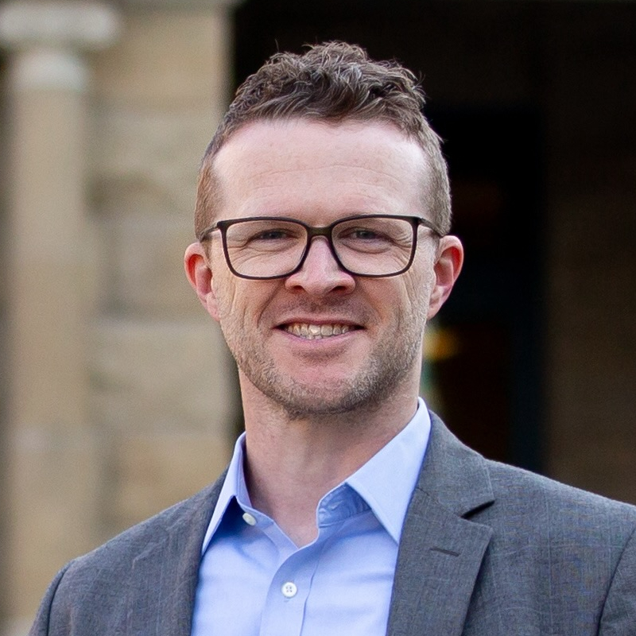

Thanks for visiting this site! I'm a Professor in the Department of Political Science at the University of Calgary. My research and teaching are in the area of Canadian politics, with a particular focus on political representation, public opinion, and voting behaviour in local and urban politics. I'm especially interested in "implicit" or "lay" theories of politics -- the working assumptions that shape how politicians and citizens understand politics.

## Questions I'm Working On

**_What are politicians' working theories of politics — and how do these theories shape their behaviour as representatives?_**

Politicians have beliefs — working theories — about how politics works: how voters make decisions, what constituents want from their representatives, how policy making really works, and so on. But we don't know very much about these theories, or about how they shape politicians' actions in office. Together with my collaborators — especially Lior Sheffer and Peter Loewen — I'm working to understand how politicians think about politics, and what follows from their thinking. So far, we've studied [elite theories of voting behaviour](2024%20-%20EJPR.pdf) among local politicians in Canada and the United States and among [national and regional politicians in eleven countries](2024%20-%20APSR.pdf). We've also studied [the relationship between politicians' theories and their decisions on related policy challenges](2023%20-%20Governance.pdf). More recently, we've been expanding the scope of our research to other domains of politics (such as persuasion) and other methodological approaches (such as an ethnographic study of first-time candidates). 

**_How — and how accurately — do politicians perceive their constituents' policy preferences?_** 

Most theories of representation assume that politicians have _some_ sense of their constituents' policy preferences. But a great deal of recent research has suggested that politicians' perceptions of their constituents' preferences are plagued by serious perceptual errors. In recent work, however, my coauthors and I have showed that these perceptual errors [vary dramatically across policy domains](2024%20-%20Political%20Behavior.pdf) and [the perceptual tasks we assign to politicians](2026%20-%20PSRM.pdf). These findings have prompted us to try to build a new framework for thinking about how politicians perceive their constituents — and then to consider how much politicians' perceptual errors really matter for the quality of representation. 

**_How do citizens think about municipal policy, and what follows for political representation?_**

We've learned a great deal about public opinion on national issues, but we know much less about how citizens think about local policy: housing, transit, economic development, parks, and so on. Do these attitudes have ideological structure, or are they organized in some other way? How much do citizens know about these issues, and who pays attention to local politics? In my book [*Ideology in Canadian Municipal Politics*](https://utppublishing.com/doi/book/10.3138/9781487553692) and related articles, I've been working to characterize municipal public opinion more clearly. More recently, I've been trying to integrate ["ideological" and "non-ideological" visions of local politics](https://osf.io/preprints/osf/jydxb_v1) and to think more about the implications of municipal "issue publics" for local political representation.

While these questions largely structure my current research, I've been fortunate to work with great collaborators on many other interesting questions related to local elections, urban-rural divides, Canadian political development, and urban governance. You can find more information about this work on my [research page](https://lucasjacklucas.github.io/publications). 

## Active Projects

I co-direct the [Canadian Municipal Barometer](http://www.cmb-bmc.ca) with Sandra Breux, a research partnership focused on municipal democracy and representation in Canada. I'm also Canadian co-PI of [POLPOP-II](https://www.uantwerpen.be/en/research-groups/m2p/polpop/polpop_2/), a comparative study of politicians in thirteen countries, and Principal Investigator for the [Canadian Voting and Policy Attitudes](https://quantoid.shinyapps.io/cvpa_app/) Project.
You can reach me at [jack.lucas@ucalgary.ca](mailto:jack.lucas@ucalgary.ca).